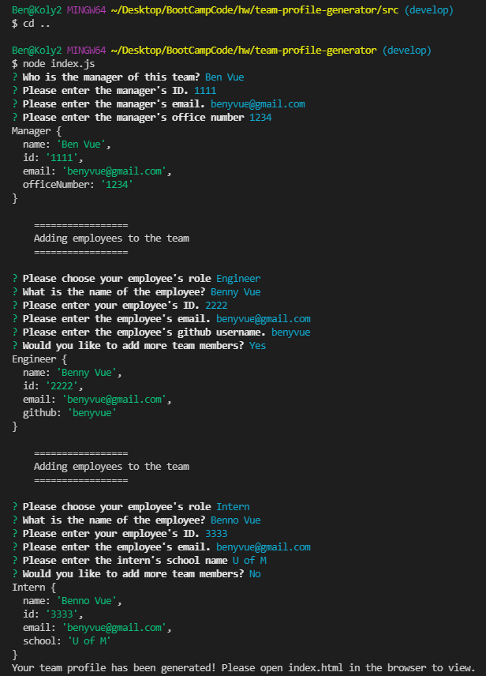

# team-profile-generator

  ## Table of Contents
  * [Description](#Description)
  * [Installation](#Installation-Instructions)
  * [Usage Instructions](#Usage-Instructions)
  
  * [Contributing Members](#Contributing-Members)
  * [Testing](#Testing)    
  * [Questions/Inquiries](#Questions/Inquiries)

  ## Preview of app in command line
  

  ## Built with
  JavaScript, Node.js, Jest, and CSS.

  ## Description
  The Team Profile Generator is used to generate profiles for a work team. It asks for the employee name, ID, email, github, and what type employee is in your group and allows for you to generate as many employee cards as needed with all the previous stated info.  

  ## Installation Instructions 
  To install, clone the repository via github located at [Github](https://benyvue.github.io/team-profile-generator/) . Then you need to download Node.js if you don't already have it. The following link will take you to the website to download Node.js [Node.js](https://nodejs.org/en/download/)

  ## Usage Instructions
  Startup the team-profile-generator with a command prompt interface, then type "npm install" to install packages for node modules. After module installations, run the application from the command line by typing in "node index.js" and proceed throught the command prompts to create your Team Profile.

  ## Video of how app works.
  [Tutorial](https://watch.screencastify.com/v/UOfx2BBVf4d7ggVBYHJX)

  ## Contributing Members
  Ben Vue

  ## Testing 
   N/A

  ## Preview of app final product
  

  ### GitHub Profile
  [GitHub Profile](http://github.com/benyvue)

  ### Email
  Please reach me at the provided email with any questions. bvue012@gmail.com